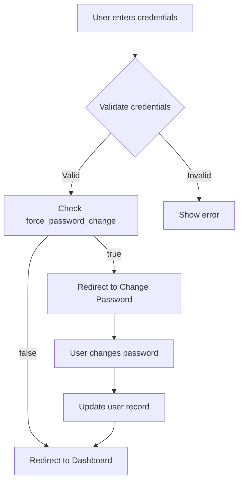
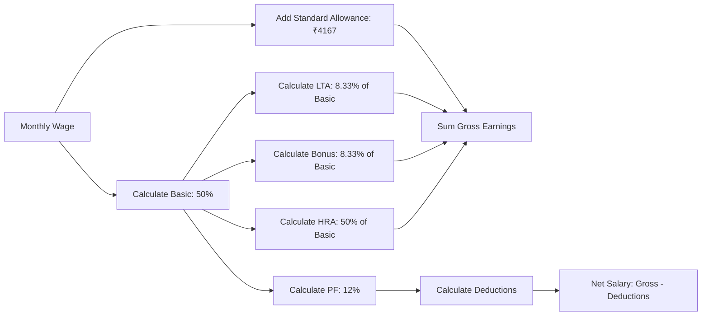

# WorkZen — Smart Human Resource Management System (HRMS)

> A complete, production-ready HRMS built with React, Vite, Tailwind CSS, and json-server. Features role-based authentication, attendance tracking, payroll management, and comprehensive reporting.

[](LICENSE)
[]()
[]()

## 📋 Table of Contents

- [Features](#features)
- [Tech Stack](#tech-stack)
- [Quickstart](#quickstart)
- [Demo Credentials](#demo-credentials)
- [Project Structure](#project-structure)
- [Architecture](#architecture)
- [Salary Calculation Rules](#salary-calculation-rules)
- [API Documentation](#api-documentation)
- [Testing](#testing)
- [Deployment](#deployment)
- [Supabase Migration](#supabase-migration)
- [Troubleshooting](#troubleshooting)
- [Contributing](#contributing)
- [License](#license)

## ✨ Features

### 🔐 Authentication & Authorization
- Role-based access control (Admin, HR Officer, Payroll Officer, Employee)
- Auto-generated Login IDs (format: `OI` + initials + year + serial)
- Secure password generation with first-time change enforcement
- Session management with JWT-like mock tokens

### 👥 Employee Management
- Complete employee lifecycle management
- Profile management with Personal, Private, Bank, and Salary tabs
- Visual status indicators (Active 🟢, On Leave ✈️, Inactive 🟡)
- Manager assignment and organizational hierarchy
- Avatar support

### ⏰ Attendance Tracking
- Daily check-in/check-out functionality
- Automatic work hours calculation
- Extra hours tracking (overtime)
- Historical attendance records
- HR/Admin overview of all employee attendance

### 🌴 Time Off Management
- Multi-type leave system (Paid, Sick, Unpaid)
- Leave balance tracking (Paid: 24 days, Sick: 7 days)
- Approval workflow for HR/Admin/Payroll officers
- Status tracking (Pending, Approved, Rejected)

### 💰 Payroll System
- Automated payrun creation for entire month
- Deterministic salary calculation engine
- Detailed payslip generation with breakdown
- Print/download functionality
- Salary components:
  - Basic (50% of wage)
  - HRA (50% of basic)
  - Standard Allowance (₹4167)
  - Performance Bonus (8.33% of basic)
  - LTA (8.33% of basic)
  - Fixed Allowance (balancing amount)
  - PF Employee & Employer (12% each)
  - Professional Tax (₹200)

### 📊 Dashboard & Analytics
- Real-time employee statistics
- Attendance overview
- Warning cards for missing data
- Payrun charts
- Leave status tracking

### 📈 Reports
- Salary statement exports
- Attendance reports (CSV)
- Time-off summaries
- Payroll overview

### ⚙️ Settings
- Company configuration
- Logo upload
- Working days customization
- Break time settings
- Salary rule modifications

## 🛠 Tech Stack

### Frontend
- **React 18** - UI library
- **Vite** - Build tool
- **TypeScript** - Type safety
- **Tailwind CSS** - Styling
- **shadcn/ui** - Component library
- **React Router** - Navigation
- **Recharts** - Data visualization
- **Axios** - HTTP client
- **date-fns** - Date utilities

### Backend (Mock)
- **json-server** - RESTful API mock
- **Node.js** - Runtime for scripts

### Testing
- **Jest** - Unit testing
- **React Testing Library** - Component testing
- **Playwright** - E2E testing (optional)

## 🚀 Quickstart

### Prerequisites
- Node.js ≥ 18.0.0
- npm or yarn or bun

### Installation

```bash
# Clone the repository
git clone <YOUR_GIT_URL>
cd workzen-hrms

# Install dependencies
npm install

# Generate mock database
npm run seed:mock

# Start mock backend (in one terminal)
npm run start:mock

# Start frontend (in another terminal)
npm run dev

# Or run both together (Unix/Mac)
./dev.sh

# Or using npm-run-all (install globally if needed)
npm install -g npm-run-all
npm run dev:all
```

The application will be available at: **http://localhost:8080**

The mock API will be running at: **http://localhost:4000**

## 🔑 Demo Credentials

| Role | Login ID | Email | Password |
|------|----------|-------|----------|
| **Admin** | `OIJODO20220001` | admin@workzen.com | Admin@123 |
| **HR Officer** | `OIJODO20220002` | hr@workzen.com | Hr@123 |
| **Payroll Officer** | `OIJODO20230003` | payroll@workzen.com | Payroll@123 |
| **Employee** | `OIJODO20240004` | employee@workzen.com | Employee@123 |

### Test Scenarios

The seeded database includes specific test cases:

1. **Employee without Bank Account** (emp_5)
   - Triggers dashboard warning
   - Name: Jane Smith
   - Email: jane@workzen.com

2. **Employee without Manager** (emp_5)
   - Shows in "Missing Manager" alert
   - Same employee as above

3. **Employee on Leave** (emp_7)
   - Status: on_leave
   - Name: Alice Brown
   - Email: alice@workzen.com
   - Leave approved: Jan 8-10, 2025

## 📁 Project Structure

```
workzen-hrms/
├── public/
│   ├── design/
│   │   └── HRMS_Flow.svg        # Design reference
│   └── robots.txt
├── src/
│   ├── components/
│   │   ├── ui/                  # shadcn components
│   │   ├── Layout.tsx           # Main layout with sidebar
│   │   ├── ProtectedRoute.tsx   # Auth guard
│   │   └── NavLink.tsx
│   ├── contexts/
│   │   └── AuthContext.tsx      # Authentication state
│   ├── hooks/
│   │   └── use-toast.ts
│   ├── lib/
│   │   ├── api.ts               # Axios instance
│   │   └── utils.ts             # Utilities
│   ├── pages/
│   │   ├── SignIn.tsx
│   │   ├── SignUp.tsx
│   │   ├── ChangePassword.tsx
│   │   ├── Dashboard.tsx
│   │   ├── Employees.tsx
│   │   ├── Attendance.tsx
│   │   ├── TimeOff.tsx
│   │   ├── Payroll.tsx
│   │   ├── Reports.tsx
│   │   ├── Settings.tsx
│   │   └── NotFound.tsx
│   ├── types/
│   │   └── index.ts             # TypeScript definitions
│   ├── utils/
│   │   ├── auth.ts              # Login ID & password generation
│   │   ├── salary.ts            # Salary calculations
│   │   └── __tests__/
│   │       └── salary.test.ts   # Unit tests
│   ├── App.tsx
│   ├── main.tsx
│   └── index.css                # Design system
├── mock/
│   └── db.json                  # Mock database
├── mock_emails/                 # Credential emails (auto-generated)
├── scripts/
│   └── seed.js                  # Database seeding script
├── tests/
│   └── e2e/                     # E2E tests (optional)
├── .env.example
├── CHANGELOG.md
├── CREDITS.md
├── demo-credentials.md
├── LICENSE
└── README.md
```

## 🏗 Architecture

### Authentication Flow



### Payroll Calculation Flow



## 💵 Salary Calculation Rules

The system uses deterministic salary calculation:

```typescript
Monthly Wage = ₹X

Earnings:
- Basic Salary = 50% of X
- HRA = 50% of Basic
- Standard Allowance = ₹4,167 (fixed)
- Performance Bonus = 8.33% of Basic
- LTA (Leave Travel Allowance) = 8.33% of Basic
- Fixed Allowance = X - (sum of above earnings)
- Gross Earnings = Sum of all earnings

Deductions:
- PF Employee = 12% of Basic
- PF Employer = 12% of Basic (informational, not deducted)
- Professional Tax = ₹200
- Total Deductions = PF Employee + Professional Tax

Net Salary = Gross Earnings - Total Deductions
```

**Example for ₹50,000/month:**
- Basic: ₹25,000
- HRA: ₹12,500
- Standard Allowance: ₹4,167
- Performance Bonus: ₹2,083
- LTA: ₹2,083
- Fixed Allowance: ₹4,167
- **Gross: ₹50,000**
- PF Employee: ₹3,000
- Professional Tax: ₹200
- **Net: ₹46,800**

## 📡 API Documentation

### Base URL
```
http://localhost:4000
```

### Endpoints

#### Users
```
GET    /users              # List all users
GET    /users/:id          # Get user by ID
POST   /users              # Create user
PATCH  /users/:id          # Update user
DELETE /users/:id          # Delete user
```

#### Employees
```
GET    /employees          # List all employees
GET    /employees/:id      # Get employee
POST   /employees          # Create employee
PATCH  /employees/:id      # Update employee
DELETE /employees/:id      # Delete employee
```

#### Attendance
```
GET    /attendance                    # List attendance
GET    /attendance?employee_id=:id    # Filter by employee
POST   /attendance                    # Check in
PATCH  /attendance/:id                # Check out
```

#### Time Offs
```
GET    /time_offs                     # List time offs
GET    /time_offs?employee_id=:id     # Filter by employee
POST   /time_offs                     # Request time off
PATCH  /time_offs/:id                 # Approve/reject
```

#### Payroll
```
GET    /payslips                      # List payslips
GET    /payslips?employee_id=:id      # Filter by employee
POST   /payslips                      # Create payslip
GET    /payruns                       # List payruns
POST   /payruns                       # Create payrun
```

#### Settings
```
GET    /company_settings              # Get settings
PUT    /company_settings/:id          # Update settings
```

### Query Parameters

json-server supports filtering, sorting, and pagination:

```bash
# Filtering
GET /employees?status=active

# Sorting
GET /attendance?_sort=date&_order=desc

# Pagination
GET /employees?_page=1&_limit=10

# Full-text search
GET /employees?q=john
```

## 🧪 Testing

### Unit Tests

```bash
# Run all tests
npm test

# Run with coverage
npm test -- --coverage

# Watch mode
npm test -- --watch
```

### E2E Tests (Optional)

```bash
# Install Playwright
npm install -D @playwright/test

# Run E2E tests
npx playwright test

# Run with UI
npx playwright test --ui
```

## 🚢 Deployment

### Vercel (Frontend)

```bash
# Install Vercel CLI
npm i -g vercel

# Deploy
vercel

# Production deployment
vercel --prod
```

**Environment Variables on Vercel:**
- `VITE_API_BASE_URL`: Your Supabase or backend API URL

### Netlify (Frontend)

```bash
# Install Netlify CLI
npm i -g netlify-cli

# Deploy
netlify deploy

# Production
netlify deploy --prod
```

### Backend Options

#### Option 1: Supabase (Recommended for Production)
See [Supabase Migration](#supabase-migration) section below.

#### Option 2: Deploy json-server (Demo/Dev only)
```bash
# Using Railway
railway up

# Using Render
# Create a new Web Service
# Build Command: npm install && npm run seed:mock
# Start Command: npm run start:mock
```

## 🔄 Supabase Migration

### Prerequisites
1. Create a Supabase account at [supabase.com](https://supabase.com)
2. Create a new project
3. Note your project URL and anon key

### Database Schema

Run this SQL in Supabase SQL Editor:

```sql
-- Enable UUID extension
CREATE EXTENSION IF NOT EXISTS "uuid-ossp";

-- Users table
CREATE TABLE users (
  id UUID PRIMARY KEY DEFAULT uuid_generate_v4(),
  login_id TEXT UNIQUE NOT NULL,
  email TEXT UNIQUE NOT NULL,
  first_name TEXT NOT NULL,
  last_name TEXT NOT NULL,
  role TEXT NOT NULL CHECK (role IN ('admin', 'hr', 'payroll', 'employee')),
  phone TEXT,
  company_name TEXT,
  company_logo TEXT,
  password_hash TEXT NOT NULL,
  force_password_change BOOLEAN DEFAULT false,
  created_at TIMESTAMPTZ DEFAULT NOW()
);

-- Employees table
CREATE TABLE employees (
  id UUID PRIMARY KEY DEFAULT uuid_generate_v4(),
  user_id UUID REFERENCES users(id) ON DELETE CASCADE,
  first_name TEXT NOT NULL,
  last_name TEXT NOT NULL,
  email TEXT NOT NULL,
  phone TEXT,
  date_of_birth DATE,
  gender TEXT,
  address TEXT,
  city TEXT,
  state TEXT,
  postal_code TEXT,
  country TEXT DEFAULT 'India',
  hire_date DATE NOT NULL,
  department TEXT,
  position TEXT,
  manager_id UUID REFERENCES employees(id),
  bank_account_number TEXT,
  bank_name TEXT,
  bank_ifsc TEXT,
  monthly_wage DECIMAL(10,2) DEFAULT 0,
  avatar_url TEXT,
  status TEXT DEFAULT 'active' CHECK (status IN ('active', 'on_leave', 'inactive'))
);

-- Attendance table
CREATE TABLE attendance (
  id UUID PRIMARY KEY DEFAULT uuid_generate_v4(),
  employee_id UUID REFERENCES employees(id) ON DELETE CASCADE,
  date DATE NOT NULL,
  check_in TIMESTAMPTZ,
  check_out TIMESTAMPTZ,
  work_hours DECIMAL(4,2),
  extra_hours DECIMAL(4,2),
  status TEXT DEFAULT 'present' CHECK (status IN ('present', 'absent', 'leave')),
  UNIQUE(employee_id, date)
);

-- Time offs table
CREATE TABLE time_offs (
  id UUID PRIMARY KEY DEFAULT uuid_generate_v4(),
  employee_id UUID REFERENCES employees(id) ON DELETE CASCADE,
  type TEXT NOT NULL CHECK (type IN ('paid', 'sick', 'unpaid')),
  start_date DATE NOT NULL,
  end_date DATE NOT NULL,
  days INTEGER NOT NULL,
  reason TEXT NOT NULL,
  status TEXT DEFAULT 'pending' CHECK (status IN ('pending', 'approved', 'rejected')),
  approved_by UUID REFERENCES users(id),
  created_at TIMESTAMPTZ DEFAULT NOW()
);

-- Leave balances table
CREATE TABLE leave_balances (
  employee_id UUID PRIMARY KEY REFERENCES employees(id) ON DELETE CASCADE,
  paid_days_remaining INTEGER DEFAULT 24,
  sick_days_remaining INTEGER DEFAULT 7
);

-- Payslips table
CREATE TABLE payslips (
  id UUID PRIMARY KEY DEFAULT uuid_generate_v4(),
  employee_id UUID REFERENCES employees(id) ON DELETE CASCADE,
  month TEXT NOT NULL,
  year INTEGER NOT NULL,
  basic DECIMAL(10,2) NOT NULL,
  hra DECIMAL(10,2) NOT NULL,
  standard_allowance DECIMAL(10,2) NOT NULL,
  performance_bonus DECIMAL(10,2) NOT NULL,
  lta DECIMAL(10,2) NOT NULL,
  fixed_allowance DECIMAL(10,2) NOT NULL,
  gross_earnings DECIMAL(10,2) NOT NULL,
  pf_employee DECIMAL(10,2) NOT NULL,
  pf_employer DECIMAL(10,2) NOT NULL,
  professional_tax DECIMAL(10,2) NOT NULL,
  total_deductions DECIMAL(10,2) NOT NULL,
  net_salary DECIMAL(10,2) NOT NULL,
  created_at TIMESTAMPTZ DEFAULT NOW(),
  UNIQUE(employee_id, month, year)
);

-- Payruns table
CREATE TABLE payruns (
  id UUID PRIMARY KEY DEFAULT uuid_generate_v4(),
  month TEXT NOT NULL,
  year INTEGER NOT NULL,
  created_by UUID REFERENCES users(id),
  created_at TIMESTAMPTZ DEFAULT NOW(),
  total_employees INTEGER NOT NULL,
  total_amount DECIMAL(12,2) NOT NULL,
  UNIQUE(month, year)
);

-- Company settings table
CREATE TABLE company_settings (
  id UUID PRIMARY KEY DEFAULT uuid_generate_v4(),
  company_name TEXT NOT NULL,
  company_short_code TEXT NOT NULL,
  logo_url TEXT,
  working_days_per_week INTEGER DEFAULT 5,
  break_time_minutes INTEGER DEFAULT 60,
  standard_allowance DECIMAL(10,2) DEFAULT 4167
);

-- Enable Row Level Security
ALTER TABLE users ENABLE ROW LEVEL SECURITY;
ALTER TABLE employees ENABLE ROW LEVEL SECURITY;
ALTER TABLE attendance ENABLE ROW LEVEL SECURITY;
ALTER TABLE time_offs ENABLE ROW LEVEL SECURITY;
ALTER TABLE leave_balances ENABLE ROW LEVEL SECURITY;
ALTER TABLE payslips ENABLE ROW LEVEL SECURITY;
ALTER TABLE payruns ENABLE ROW LEVEL SECURITY;
ALTER TABLE company_settings ENABLE ROW LEVEL SECURITY;

-- Create policies (example - customize based on your needs)
CREATE POLICY "Users can read own data" ON users FOR SELECT USING (auth.uid()::text = id::text);
CREATE POLICY "Admins can read all users" ON users FOR SELECT USING (
  EXISTS (SELECT 1 FROM users WHERE id::text = auth.uid()::text AND role = 'admin')
);
```

### Seed Data

Insert demo data using Supabase Studio or SQL:

```sql
-- Insert demo users (use Supabase Auth for real passwords)
INSERT INTO users (id, login_id, email, first_name, last_name, role, password_hash)
VALUES 
  (uuid_generate_v4(), 'OIJODO20220001', 'admin@workzen.com', 'John', 'Doe', 'admin', 'hashed_password'),
  (uuid_generate_v4(), 'OIJODO20220002', 'hr@workzen.com', 'Jane', 'Smith', 'hr', 'hashed_password');

-- Insert employees, attendance, etc. following similar pattern
```

### Update Frontend Configuration

1. Copy `.env.example` to `.env`:
```bash
cp .env.example .env
```

2. Update `.env`:
```env
VITE_API_BASE_URL=https://your-project.supabase.co/rest/v1
VITE_SUPABASE_URL=https://your-project.supabase.co
VITE_SUPABASE_ANON_KEY=your_anon_key
```

3. Update `src/lib/api.ts` to use Supabase client instead of axios (optional).

## 🐛 Troubleshooting

### Issue: Mock backend not starting

**Solution:**
```bash
# Ensure port 4000 is free
lsof -ti:4000 | xargs kill -9

# Regenerate database
npm run seed:mock

# Start again
npm run start:mock
```

### Issue: Frontend can't connect to backend

**Solution:**
- Check that both frontend (8080) and backend (4000) are running
- Verify `VITE_API_BASE_URL` in `.env` or `.env.local`
- Clear browser cache and localStorage

### Issue: Tests failing

**Solution:**
```bash
# Clear Jest cache
npm test -- --clearCache

# Update snapshots
npm test -- -u

# Run specific test
npm test -- salary.test.ts
```

### Issue: Build errors

**Solution:**
```bash
# Clean install
rm -rf node_modules package-lock.json
npm install

# Clear Vite cache
rm -rf node_modules/.vite

# Rebuild
npm run build
```

## 🤝 Contributing

We welcome contributions! Please follow these steps:

1. Fork the repository
2. Create a feature branch (`git checkout -b feature/amazing-feature`)
3. Commit your changes (`git commit -m 'Add amazing feature'`)
4. Push to the branch (`git push origin feature/amazing-feature`)
5. Open a Pull Request

### Development Guidelines

- Follow TypeScript best practices
- Write unit tests for utility functions
- Update documentation for new features
- Use semantic commit messages
- Ensure all tests pass before submitting PR

## 📄 License

This project is licensed under the MIT License - see the [LICENSE](LICENSE) file for details.

## 🙏 Acknowledgments

- Built with ❤️ using [Lovable.ai](https://lovable.ai)
- UI components from [shadcn/ui](https://ui.shadcn.com/)
- Icons from [Lucide](https://lucide.dev/)
- Design inspiration from modern HRMS platforms

## 📞 Support

For issues, questions, or contributions:
- Open an issue on GitHub
- Email: support@workzen.dev
- Documentation: [docs.workzen.dev](https://docs.workzen.dev)

---

**Made with ❤️ by the WorkZen Team**
